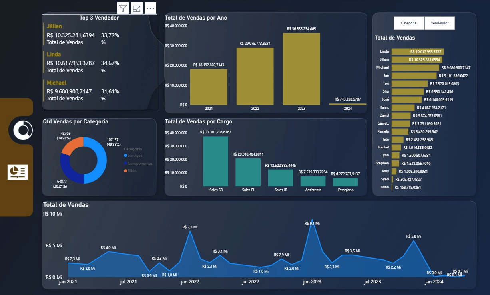

# 🚲 Projeto ETL e Dashboard - Loja de Bikes

Projeto desenvolvido com foco em **ETL, transformação de dados e visualização analítica**, utilizando **Excel, Power Query e Power BI** para transformar dados brutos de vendas em informações estratégicas para apoio à tomada de decisão.

---

## 📝 Sobre o Projeto

Este projeto foi construído a partir de uma base de vendas de uma loja de bikes, com o objetivo de estruturar um processo ETL e desenvolver um dashboard analítico no **Power BI**.

A solução envolve a extração de dados a partir de planilhas em Excel, o tratamento e a padronização das informações no **Power Query** e a construção de visualizações interativas para análise de desempenho comercial.

---

## 🎯 Objetivo do Projeto

O objetivo deste projeto foi:

- extrair dados de vendas a partir de planilhas em Excel
- realizar limpeza e transformação de dados com Power Query
- estruturar um pipeline ETL para preparação da base
- criar métricas de desempenho comercial
- desenvolver um dashboard interativo no Power BI
- gerar insights para apoio à tomada de decisão

---

## ⚙️ Etapas do Projeto

### 1. Extração dos Dados
Os dados foram obtidos a partir de uma planilha de vendas em Excel.

### 2. Transformação e Limpeza
Foi realizado um processo ETL com apoio do **Power Query**, incluindo:

- tratamento de inconsistências
- padronização de colunas
- organização dos dados para análise
- preparação da base para visualização

### 3. Construção do Dashboard
Após o tratamento dos dados, foi desenvolvido um dashboard analítico no **Power BI**, com foco em indicadores comerciais e análise temporal das vendas.

---

## 📊 Visão Geral do Dashboard

O painel inicial foi estruturado para apresentar uma visão ampla do desempenho de vendas da loja, reunindo indicadores e gráficos estratégicos.

Entre os principais elementos do dashboard estão:

- **Top 3 vendedores**, com destaque para os maiores volumes de vendas
- **Gráfico de colunas clusterizado** com o total de vendas por ano, cobrindo o período de **2021 a 2024**
- **Parâmetro de análise** para alternar a visualização do gráfico de barras entre **categoria** e **vendedor**
- **Gráfico de rosca** com a quantidade de vendas por categoria
- **Gráfico de colunas clusterizado** com o total de vendas por cargo
- **Gráfico de área** mostrando a evolução do total de vendas por mês e ano

---

## 📈 Indicadores e Análises Desenvolvidas

O dashboard permite analisar:

- desempenho anual de vendas
- evolução das vendas ao longo do tempo
- participação dos principais vendedores
- quantidade de vendas por categoria
- comparação de vendas por cargo
- segmentação dinâmica com parâmetro de categoria e vendedor

---

## 🖼 Dashboard

### Painel Inicial

---

## 💡 Principais Insights que o Dashboard Pode Gerar

Com esse dashboard, é possível:

- identificar os vendedores com melhor desempenho
- acompanhar o crescimento ou queda das vendas por ano
- analisar o comportamento das vendas ao longo dos meses
- comparar a participação de categorias no volume de vendas
- entender quais cargos concentram maior resultado comercial
- alternar rapidamente a análise entre categoria e vendedor

---

## 🛠 Tecnologias Utilizadas

- **Power BI**
- **Power Query**
- **Excel**
- **ETL**
- **Modelagem de Dados**
- **Visualização de Dados**

---

## ▶️ Como Visualizar

1. Baixe o arquivo `.pbix` disponível no repositório
2. Abra no **Power BI Desktop**
3. Explore as páginas, filtros e visuais do dashboard

---

## 📖 Aprendizados

Durante o desenvolvimento deste projeto foram aplicados conceitos importantes como:

- construção de pipeline ETL
- limpeza e transformação de dados com Power Query
- modelagem e preparação de dados para análise
- criação de dashboards interativos no Power BI
- desenvolvimento de métricas para análise comercial
- uso de parâmetros para segmentação dinâmica de visuais
- análise temporal de vendas

---

## 👨‍💻 Autor

**Pedro Vasconcelos de Pinho**  

Estudante de Ciência da Computação
